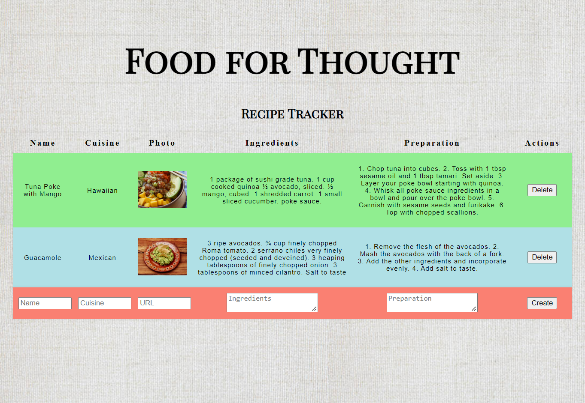

# Food for Thought | Recipe-Tracking App

Food for Thought is a live application that allows a user to view a list of recipes, add new recipes, and delete existing recipes.

## Links
[Live Vercel Client App](https://recipe-tracking-app-alpha.vercel.app/)  

## Technology
- JavaScript, React, HTML, CSS  
  

  
  
## Installation
1. Fork and clone this repository.
2. Run `npm install` to install project dependencies.
3. Run `npm start` to start the application.

## App Features

A user can view a list of recipes and add new recipes to that list by entering information in form fields and clicking the `Create` button. A user can also delete a specific recipe by clicking the `Delete` button.  

  
